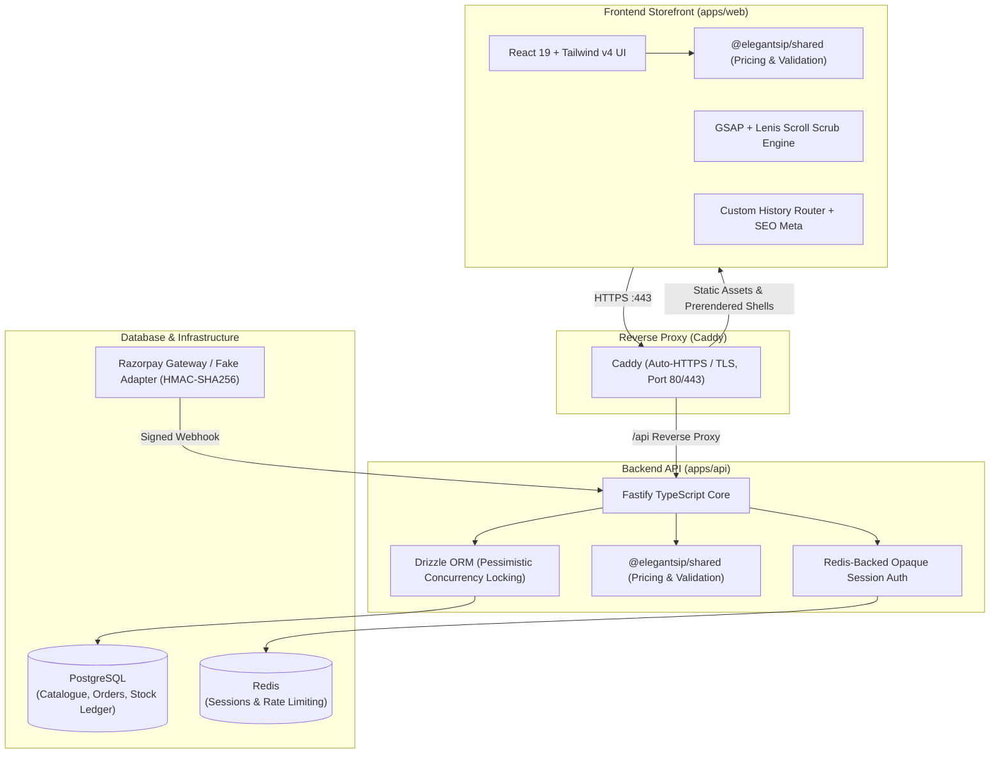

# Elegant Sip  Full-Stack E-Commerce Case Study

> **A high-craft, single-origin Darjeeling tea e-commerce platform & monorepo combining cinematic scroll storytelling with enterprise-grade financial and transactional integrity.**

---

## 📌 Quick Portfolio Blurb (Copy-Paste Ready)

### Short Summary (For Project Cards & Resume)
> **Elegant Sip** is a production-ready, full-stack monorepo e-commerce platform built for a boutique single-origin Darjeeling tea brand. It features a React 19 + GSAP cinematic scroll-scrubbed storefront, paired with a Fastify, PostgreSQL (Drizzle ORM), and Redis backend. Built with a strict "honesty-first" engineering philosophy, it implements deterministic Indian tax math (whole-rupee INR & 5% GST), pessimistic stock concurrency locks (`SELECT FOR UPDATE`), automated build-time SEO prerendering, and containerized deployment with Caddy reverse proxy.

### Tech Stack Tags
`React 19` · `TypeScript` · `Vite 7` · `Tailwind CSS v4` · `GSAP / ScrollTrigger` · `Fastify` · `PostgreSQL` · `Drizzle ORM` · `Redis` · `Zod / OpenAPI` · `Docker & Compose` · `Caddy` · `Razorpay Webhooks`

---

## 🍵 Project Overview

Elegant Sip is a digital flagship storefront and transactional backend designed for a luxury direct-from-garden Darjeeling tea brand. 

Rather than relying on off-the-shelf templates or typical bloated headless commerce setups, Elegant Sip was engineered from the ground up to solve two distinct challenges:
1. **Uncompromising Brand Aesthetics:** Delivering an editorial, luxury-grade visual identity with smooth scroll-driven video storytelling and instant responsiveness across desktop and mobile devices.
2. **Unyielding Engineering Integrity:** Guaranteeing zero drift between what a customer is shown and what they are charged, absolute prevention of inventory overselling under high concurrency, verifiable reviews, and deterministic tax and invoice generation.

---

## 🏛️ System Architecture

The project is structured as a TypeScript **monorepo**:

```
elegantsip/
├── apps/
│   ├── web/                # Storefront (Vite 7 + React 19 + Tailwind v4 + GSAP)
│   └── api/                # Backend (Fastify + PostgreSQL + Drizzle ORM + Redis)
├── packages/
│   └── shared/             # Shared contracts, Zod schemas & unified financial logic
├── docker-compose.prod.yml # Single-origin production orchestration (Caddy + API + DB + Redis)
└── scripts/                # Automated crawl-based SEO validators & smoke test runners
```

### Architectural Breakdown



---

## ⚡ Core Features & User Journeys

### 1. Dual Homepage Cinematic Experience
- **Desktop (≥1024px):** A 500vh scroll runway featuring a full-screen keyframe-scrubbed video narrative, unlocking an expanding canvas that introduces tea estates, processing methods, and tea collections.
- **Mobile (<1024px):** A dedicated 320vh vertical video scroll hero transitioning into smooth horizontal touch-snap carousels, responsive pill controls, and ambient layout adjustments.
- **Interactive Taste Matcher Quiz:** Guides visitors through flavor profiles (floral, muscatel, brisk, woodsmoke) to recommend exact flush and estate pairings.

### 2. Catalogue & Commerce Engine
- **Single-Origin Catalogue:** Showcases Darjeeling First Flush, Second Flush, and Autumnal flushes sourced directly from iconic estates (Gopaldhara, Rohini).
- **Cart & Dynamic Pricing:** Real-time quote calculations with automatic variant stock validation and instant cart synchronization.
- **Indian Commerce Localization:** Complete whole-rupee INR math (`₹1,25,000`), 5% GST handling on products and shipping, free-shipping threshold rules, and pin-code delivery estimates.
- **Customer Accounts & Order History:** Address book management, active tracking, itemized breakdown, and provisional/tax invoice generation.
- **Verified Reviews System:** Customer reviews cryptographically tied to paid order records  the "Verified Buyer" badge is server-enforced, never client-claimed.

---

## 💡 Deep Dives: Hard Technical Problems Solved

### 1. Zero-Drift Financial Engine (`@elegantsip/shared`)
- **Problem:** E-commerce applications often suffer from rounding drift between frontend display totals and backend payment capture amounts, leading to checkout failures or incorrect tax reporting.
- **Solution:** Designed a unified `calculatePricing()` engine within `@elegantsip/shared` executed simultaneously by the client (for live rendering) and server (for order creation). 
- All internal transactions operate in **integer paise** with whole-rupee rounding tests asserting mathematical consistency across every value from ₹0 to ₹20,000.
- **Client Price Isolation:** The client never sends a `unitPrice` to the server. The API strictly looks up live product prices by `(slug, variant)` and rejects or ignores any client-supplied price parameters.

### 2. High-Performance Scroll-Video Scrubbing (60 FPS)
- **Problem:** Scrubbing raw HTML5 video on scroll causes severe browser frame drops, stuttering, and HTTP range request "cancel storms" on slow mobile networks.
- **Solution:**
  - Re-encoded all video assets using **all-intra compression (GOP=1 / every frame an IDR keyframe)** via custom FFmpeg pipelines.
  - Implemented a seek proxy that clamps playback head requests strictly within buffered `TimeRanges`.
  - Decoupled continuous scroll progress from React state churn by writing direct DOM transformations while only pushing quantized milestones (e.g., `progress > 0.95`) to React state.

### 3. Concurrency-Safe Stock Management & Anti-Overselling
- **Problem:** Flash sales and limited seasonal harvests can lead to race conditions where two customers purchase the last package simultaneously.
- **Solution:** `POST /v1/orders` wraps stock reservation in a PostgreSQL transaction utilizing `SELECT ... FOR UPDATE` row-level locks on product variants. Stock balances are guarded by database-level `CHECK (stock >= 0)` constraints, and all changes append an immutable record to the `stock_ledger` audit table.

### 4. Idempotent & Cryptographically Secure Payments
- **Problem:** Browser crashes or disconnections after gateway payment can cause unfulfilled orders or double charges.
- **Solution:** 
  - The browser return only displays pending status; an order is **only marked paid upon receipt of a verified gateway webhook**.
  - Webhooks enforce raw-body HMAC-SHA256 signature verification.
  - Idempotency is strictly guarded via a database unique constraint on `(provider, event_id)`.
  - Built an interchangeable Payment Gateway Adapter (`FakeGateway` vs `RazorpayGateway`) allowing full end-to-end checkout testing in CI/CD without live sandbox credentials.

### 5. Build-Time SEO Prerendering & Automated Quality Gates
- **Problem:** Client-side SPAs suffer from poor crawler indexing and missing social metadata.
- **Solution:** Custom static prerender script generates per-route static HTML shells with distinct JSON-LD structured data (Product, Organization, BreadcrumbList), Open Graph headers, and auto-generated `sitemap.xml` / `robots.txt`.
- Built a custom crawler-based SEO audit tool (`npm run seo:check`) that runs before deployments to validate canonicals, heading hierarchies (single `h1`), image alt coverage, and schema compliance.

---

## 🛠️ Technology Stack Deep Dive

| Layer | Technologies & Tools | Why Chosen |
|---|---|---|
| **Frontend** | React 19, TypeScript, Vite 7, Tailwind CSS v4 | Maximum rendering speed, strict type safety, zero runtime CSS overhead |
| **Animation & UX** | GSAP, ScrollTrigger, @gsap/react, Lenis | Micro-choreographed scroll transitions and smooth 60fps frame scrubbing |
| **Backend API** | Fastify, TypeScript, Zod | Low overhead, ultra-fast request throughput, type-driven route schemas |
| **Database & ORM** | PostgreSQL 16, Drizzle ORM | Relational data integrity, schema migrations, lightweight zero-bloat SQL |
| **Cache & Sessions** | Redis | High-speed ephemeral session store with opaque, secure `httpOnly` cookies |
| **Contracts / API Docs** | Zod → OpenAPI / Swagger UI | Auto-generated OpenAPI v3 spec guaranteed to never drift from route types |
| **Deployment / Infra** | Docker, Caddy, Linux VPS | Single-origin reverse proxy, automated Let's Encrypt TLS certificates, zero CORS issues |
| **Testing & Quality** | Vitest, ESLint, Custom SEO Crawler, Smoke Test Suites | Full end-to-end coverage across money math, concurrency, and SEO integrity |

---

## 🚀 Key Takeaways & Engineering Philosophy

1. **"Honesty as an Engineering Constraint":** The UI never fabricates states. A coming-soon product cannot be added to cart; an invoice without a GSTIN is explicitly marked provisional; reviews without verified purchase records lack badges; and emails report realistic delivery states.
2. **Monorepo Cohesion:** Shared contracts (`@elegantsip/shared`) eliminate contract drift between client and server, turning runtime bugs into compile-time errors.
3. **Resilience & Graceful Degradation:** The storefront operates off a build-time catalogue snapshot, allowing instant paint and crawler availability even if the database is offline, while keeping all transactional paths dynamic and guarded.

---

## 📬 Contact & Links

- **GitHub Repository:** [github.com/your-username/elegantsip](https://github.com) *(Update with your repo URL)*
- **Live Demo:** [elegantsip.in](https://elegantsip.in)
- **Developer:** Rahul *(Your Portfolio Link / LinkedIn Link)*
